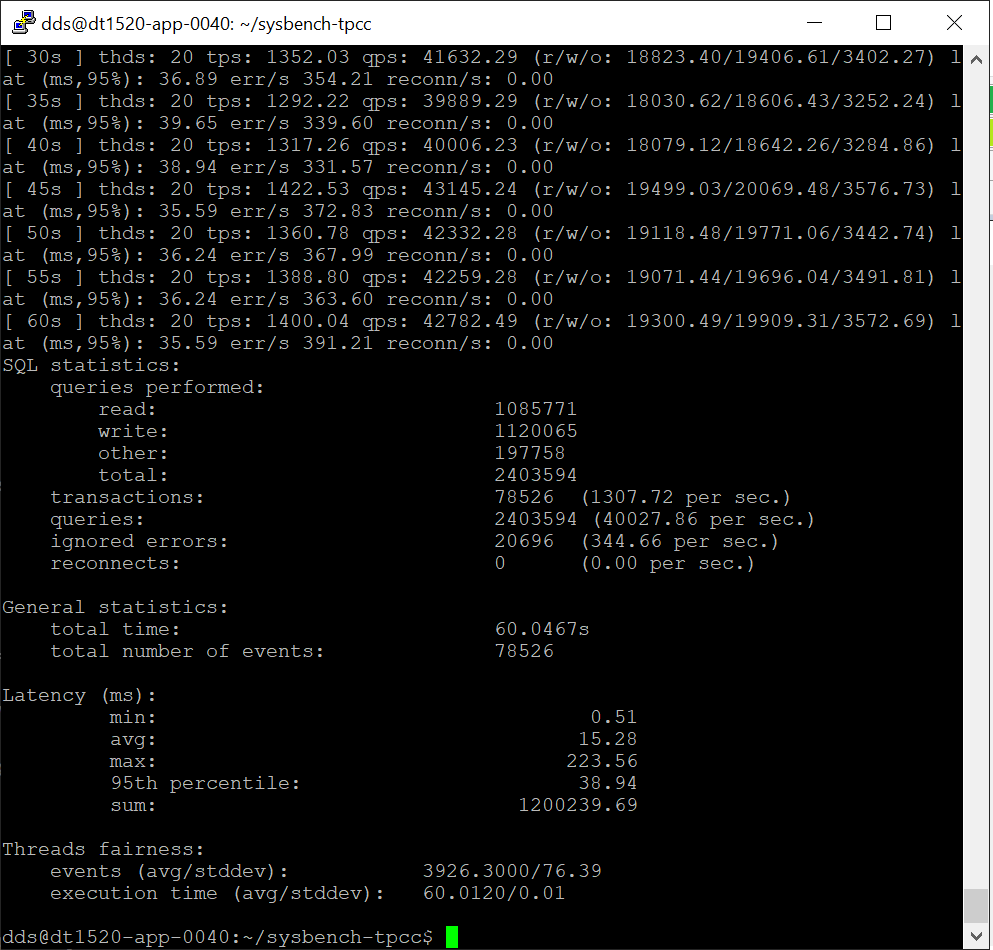

# Итоговая работа 
# БД для системы согласования и передачи проектно-сметной документации.

## Описание
Разработать и спроектировать БД для системы согласования и передачи проектно-сметной документации. 
Система предназначена для хранения и передачи полной или частичной проектной документации между исполнитель и субподрядчиком,
так-же передачу проектной документации в Регулирующие органы и заказчику.

В рамках курсовой работы будет выполнены следующие части данной задачи:
* Выполнение настройки Postgres 15 с учетом предоставленного стэнда
* Проектирование архетектуры высоконагруженных таблиц (втч индексации, секционирование и построени table space)
* Построение репликаций (базовыми методами)
* Разработка хранимых функций для работы с данными таблицами
* Анализ результатов

# Подготовка
Развернут стенд для выполнения работы ( виртуальная машина развернута внутри инфраструктуры ):

ОС: Ubuntu 22.04
CPU: 8 Core
Ram: 16Gb
Storage 1: 256 Gb SSD
Storage 2: 128 Gb SSD

Установлен PG SQL 15.

# Основная работа
## Настройка postgres

Для настройки серверной части будет использован специализированный сервис, предоставляющий рекомендации по конфигурации *postgre*: https://pgconfigurator.cybertec.at/ <br/>
**Учитываем в настройках, что данные о передачи документации и саму документацию необходимо сохранять любой ценой.**


Для анализа производительности проведем с помощью утиллиты *sysbench*: https://github.com/Percona-Lab/sysbench-tpcc
<br/>
Снимаем показания до настроек:<br/>
./tpcc.lua --pgsql-port=5432 --pgsql-user=postgres --pgsql-password=**** --pgsql-db=speedtest --time=60 --scale=10 --threads=2 --report-interval=1 --tables=1 --db-driver=pgsql prepare<br/>
./tpcc.lua --pgsql-port=5432 --pgsql-user=postgres --pgsql-password=ghbt[fkb --pgsql-db=speedtest --time=60 --scale=10 --threads=2 --report-interval=5 --tables=1 --db-driver=pgsql run<br/>


В связи с необходимостью установки серверной части на стороне субподрядчиков и подрядчиков конфигурация *postgres* выполняется по средствам SQL скрипта.
```
--- connection ---
ALTER SYSTEM SET max_connections = 400;
ALTER SYSTEM SET superuser_reserved_connections = 6;
--- memory ---
ALTER SYSTEM SET shared_buffers = '4096 MB';
ALTER SYSTEM SET work_mem = '32 MB';
ALTER SYSTEM SET maintenance_work_mem = '320 MB';
ALTER SYSTEM SET huge_pages = off;
ALTER SYSTEM SET effective_cache_size = '11 GB';
ALTER SYSTEM SET effective_io_concurrency = 100;
ALTER SYSTEM SET random_page_cost = 1.25;

--- monitoring ---
ALTER SYSTEM SET shared_preload_libraries = 'pg_stat_statements';
ALTER SYSTEM SET track_io_timing=on;

--- replications ---
ALTER SYSTEM SET wal_level = replica;
ALTER SYSTEM SET max_wal_senders = 10;
ALTER SYSTEM SET synchronous_commit = on;

--- checkpoint ---
ALTER SYSTEM SET checkpoint_timeout  = '15 min';
ALTER SYSTEM SET checkpoint_completion_target = 0.9;
ALTER SYSTEM SET max_wal_size = '10240 MB';
ALTER SYSTEM SET min_wal_size = '5120 MB';

--- WAL writing
ALTER SYSTEM SET wal_compression = on;
ALTER SYSTEM SET wal_buffers = -1;
ALTER SYSTEM SET wal_writer_delay = '200ms';
ALTER SYSTEM SET wal_writer_flush_after = '1MB';
ALTER SYSTEM SET wal_keep_size = '22080 MB';

--- Background writer ---
ALTER SYSTEM SET bgwriter_delay = '200ms';
ALTER SYSTEM SET bgwriter_lru_maxpages = 100;
ALTER SYSTEM SET bgwriter_lru_multiplier = 2.0;
ALTER SYSTEM SET bgwriter_flush_after = 0;

--- parallel queries ---
ALTER SYSTEM SET max_worker_processes = 8;
ALTER SYSTEM SET max_parallel_workers_per_gather = 4;
ALTER SYSTEM SET max_parallel_maintenance_workers = 4;
ALTER SYSTEM SET max_parallel_workers = 8;
ALTER SYSTEM SET parallel_leader_participation = on;

--- additional features ---
ALTER SYSTEM SET enable_partitionwise_join = on;
ALTER SYSTEM SET enable_partitionwise_aggregate = on;
ALTER SYSTEM SET jit = on;
ALTER SYSTEM SET max_slot_wal_keep_size = '1000 MB';
ALTER SYSTEM SET track_wal_io_timing = on;
ALTER SYSTEM SET maintenance_io_concurrency = 100;
ALTER SYSTEM SET wal_recycle = on; 

SELECT pg_reload_conf();
```

Перезагружаем серверную часть и проверяем что ядро запустилось



К сожалению имеем небольшие потери в производительности, за счет гарантии отсутствия потерь данных. 

## Проектирование БД.
	
За основу проекта БД берутся текущие разработки внутри компании, так-же разработки компний смежников. <br/>
В рамках данной итоговой работы будет представлена реализация таблиц и скриптов работы с ними отвечающих за историю передачи состава проекта,<br/>
таблицы для хранения состава проекта, минимальный необходимый набор справочников. <br/>

Первым делом создадим отдельные табличные пространства для новой БД. Это может помочь с бэкапированием, маштабированием и при проблемах с серверами, например недостаток пространства.

```
create tablespace uis_tablespace location '/var/db/uis';
create database uis with tablespace = uis_tablespace;
```

Т.К. взаимодействовать с БД будет не каждый клиент по отдельности а централизованная серверная часть, добавлять отдельные роли нет необходимости.<br/>
Будут созданы два пользователя - бд админ, и пользователь для чтения/записи данных.

## Таблицы БД

Таблицы должны обеспечить хранение состава проектной документации. Согласно 87 постановления правительства РФ они представляет древовидную структуру.
Глубина дерева может достигать 7 уровней вложенности. При этом есть стандартизированные по постановлению разделы и подразделы, которые будут вынесены в справочник, 
стандартизированные на уровне предприятия. По мимо стандартизированных есть элементы формируемые на усмотрение ГИПа.
У каждого нижнего листа состава проекта есть прикрепленный том содержащий набор томов у каждого из которых есть набор файлов.
При взаимодействии с заказчиком передаются как файлы так и часть дерева состава проекта.

Ниже приведен листинг создания таблиц для БД:
```
drop table if exists public.volume_files;
drop table if exists public.partition_volume;
drop table if exists public.project_partitions;
drop table if exists public.sending_log;
drop table if exists public.project_partitions_tree;
drop table if exists public.partition_element_type;
drop table if exists public.contracts;
drop table if exists public.titul;
drop table if exists public.sending_log;
drop table if exists public.log_status;
drop table if exists public.log_action;
------- system ------------

create table public.partition_element_type(
	id integer primary key,
	name text
);

create table public.project_partitions_tree(
	id uuid default gen_random_uuid() primary key,
	parent_id uuid,
	name text,
	type_id integer,
	element_number varchar(16),
	element_code varchar(16),
	date_from timestamptz,
	date_to timestamptz,
	deleted boolean default(false)
); 

create table public.titul (
	id uuid default gen_random_uuid() primary key,
	name text,
	storage_path text
);

create table public.contracts (
	id uuid default gen_random_uuid() primary key,
	titul_id uuid not null,
	number varchar(64),
	legal_number varchar(64),
	name text	
);

create table public.project_partitions(
	row_id uuid default gen_random_uuid() primary key,
	parent_row_id uuid default gen_random_uuid(),
	template_partition_id uuid not null,
	name text,
	partition_number varchar(16),
	deleted boolean default(false),
	updated timestamptz default(CURRENT_TIMESTAMP),
	stage varchar(64),
	contract_id uuid
);


create table public.partition_volume(
	id uuid default gen_random_uuid() primary key,
	partition_id uuid,
	name text,
	deleted boolean default(false),
	number varchar(64)
	
);


create table public.volume_files(
	id uuid default gen_random_uuid() primary key,
	volume_id uuid,
	file_name varchar(512),
	deleted boolean default(false),
	storage_location varchar(1024)
);
--- log  ---


create table public.log_status (
	id integer primary key,
	name varchar(512) 
);

create table public.log_action (
	id integer primary key,
	name varchar(512)
);

create table public.sending_log (
	rowid uuid default gen_random_uuid()  primary key,
	action integer,
	status integer,
	"user" varchar(512),
	pc varchar(512),
	message text,
	log_date timestamptz default (CURRENT_TIMESTAMP),
	linked_partition uuid 
);
```

И соответственно нормализация структуры данных:
```
------ FK --------

alter table public.partition_volume 
add constraint partition_volume_fk
foreign key(partition_id)
references public.project_partitions(row_id);

alter table public.volume_files 
add constraint volume_files_fk
foreign key(volume_id)
references public.partition_volume(id);

alter table public.sending_log 
add constraint sending_log_status_fk
foreign key(status)
references public.log_status(id);

alter table public.sending_log 
add constraint sending_log_action_fk
foreign key(action)
references public.log_action(id);

alter table public.project_partitions_tree 
add constraint project_partitions_element_type_fk
foreign key (type_id) 
references public.partition_element_type(id);

alter table public.contracts 
drop constraint if exists contract_titul_fk;

alter table public.contracts 
add constraint contract_titul_fk
foreign key (titul_id) 
references public.titul(id);

alter table public.project_partitions 
drop constraint if exists pp_partition_tree_fk;

alter table public.project_partitions 
add constraint pp_partition_tree_fk
foreign key (template_partition_id) 
references public.project_partitions_tree(id);

alter table public.project_partitions 
drop constraint if exists pp_contract_fk;

alter table public.project_partitions 
add constraint pp_contract_fk
foreign key (contract_id) 
references public.contracts (id);
```


