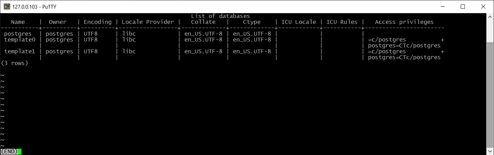

# Домашняя работа №4

# Подготовка
*Для выполнения домашней работы было разрешено использовать более позднии версии postgres*  

# Основная работа

> создайте новый кластер PostgresSQL 14  
> зайдите в созданный кластер под пользователем postgres  
> создайте новую базу данных testdb  
> зайдите в созданную базу данных под пользователем postgres  
> создайте новую схему testnm  
> создайте новую таблицу t1 с одной колонкой c1 типа integer  
> вставьте строку со значением c1=1  

На нашем кластере отсутствуют стороннии БД. Кластер не имел каких-либо доп настроек, кроме доступа наружу.

Выполняем подготовительные шаги.

> создайте новую роль readonly 
> дайте новой роли право на подключение к базе данных testdb 
> дайте новой роли право на использование схемы testnm 
> дайте новой роли право на select для всех таблиц схемы testnm 
> создайте пользователя testread с паролем test123 
> дайте роль readonly пользователю testread 

Создали необходимые роли

> зайдите под пользователем testread в базу данных testdb 
> сделайте select * from t1; 
> получилось? (могло если вы делали сами не по шпаргалке и не упустили один существенный момент про который позже) 
> напишите что именно произошло в тексте домашнего задания 
> у вас есть идеи почему? ведь права то дали?  
> посмотрите на список таблиц 
> подсказка в шпаргалке под пунктом 20 
> а почему так получилось с таблицей (если делали сами и без шпаргалки то может у вас все нормально) 

Выполнили попытку чтения. 

Прав на чтение нет, в связи с тем что, пользователь testread имеет права на SELECT только в схеме testnm. 
Пользователь так-же не явно через public получил возможность просмотра содержащихся в схеме public таблиц,  
по этому ошибка нет доступа на чтение, а не объект не найден. 

>> (могло если вы делали сами не по шпаргалке и не упустили один существенный момент про который позже) 
>> при определенных настройках search_path таблица при создании могла получить схему не public, а testnm 

>> посмотрите на список таблиц 
>> см. рис подготовки 

> вернитесь в базу данных testdb под пользователем postgres 
> удалите таблицу t1 
> создайте ее заново но уже с явным указанием имени схемы testnm 
> вставьте строку со значением c1=1 

> зайдите под пользователем testread в базу данных testdb
>  сделайте select * from testnm.t1;
>  получилось?
>  есть идеи почему? если нет - смотрите шпаргалку
>  как сделать так чтобы такое больше не повторялось? если нет идей - смотрите шпаргалку
>  сделайте select * from testnm.t1;
>  получилось?
>  есть идеи почему? если нет - смотрите шпаргалку
>  сделайте select * from testnm.t1;
>  получилось?
>  ура!

Выполняем select

Прав на чтение нет

>>  есть идеи почему? если нет - смотрите шпаргалку

Когда выдаются права на схему, PG проходит по всем объектам внутри и раздает права.
До удаления таблицы мы могли таким образом посмотреть содержимое.

>>  как сделать так чтобы такое больше не повторялось? если нет идей - смотрите шпаргалку

Либо повторно выдать права на схему, либо конкретно на таблицу

после чего чтение прошло успешно, так как права заного выданы.

>   теперь попробуйте выполнить команду create table t2(c1 integer); insert into t2 values (2);
>   а как так? нам же никто прав на создание таблиц и insert в них под ролью readonly?
>   есть идеи как убрать эти права? если нет - смотрите шпаргалку
>   если вы справились сами то расскажите что сделали и почему, если смотрели шпаргалку - объясните что 
      сделали и почему выполнив указанные в ней команды

>   теперь попробуйте выполнить команду create table t3(c1 integer); insert into t2 values (2);
>   расскажите что получилось и почему 

# Задача со звёздочкой
404 - Not found