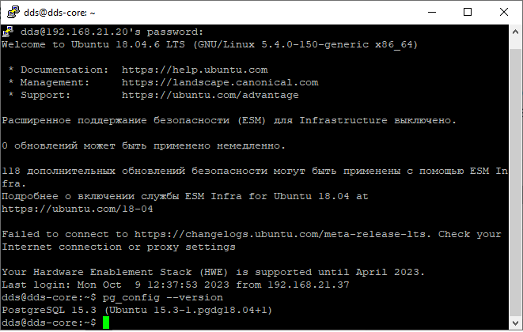
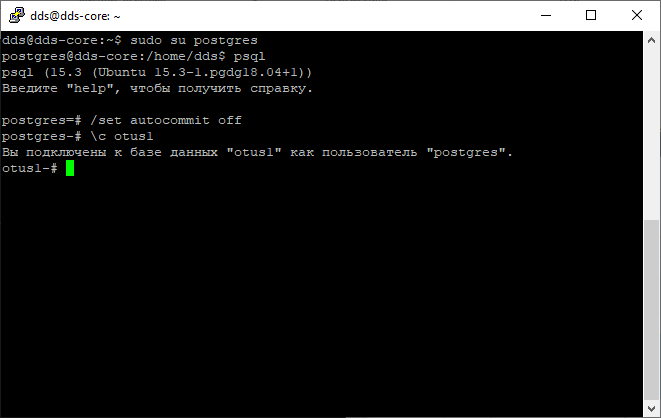
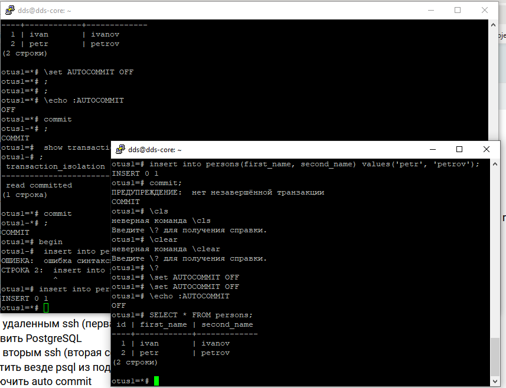
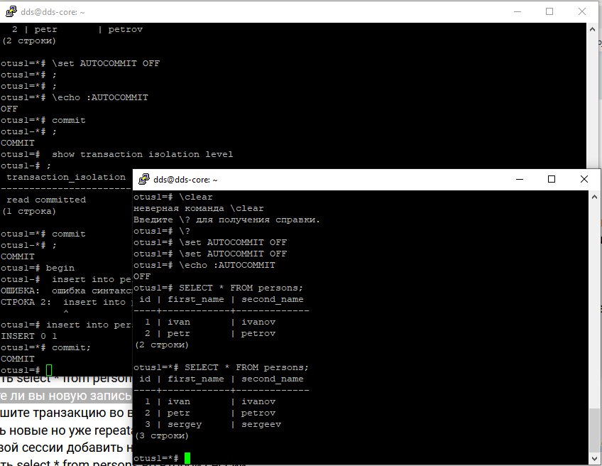
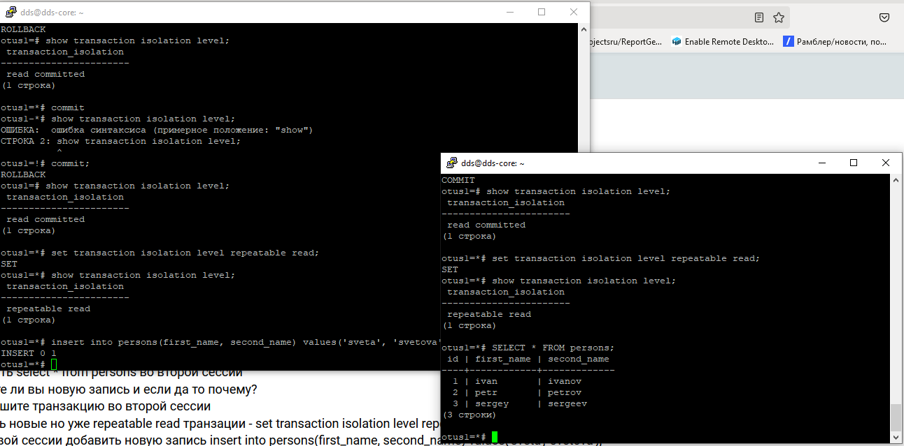
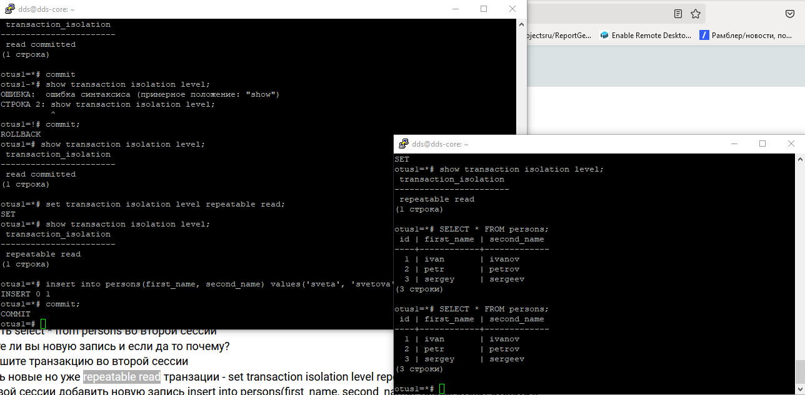
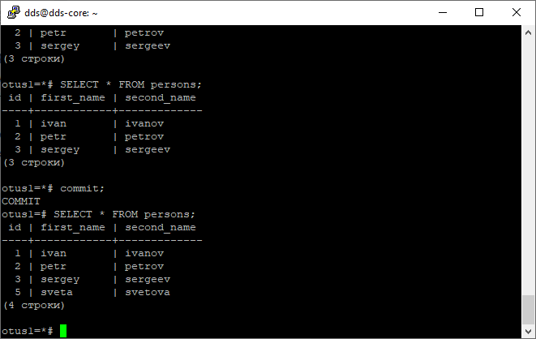

# Подготовка

### Развернута виртуальная среда для лабораторных работ в системе виртуализации Oracle VM VirtualBox\

  Подключение по *ssh* осуществляется по средствам *putty*

### В двух консолях открыто подключение к серверу PG. Установлен **AUTOCOMMIT** в **OFF**
### Установлено подключение к лабораторной БД. Созданы таблицы.

> Посмотреть текущий уровень изоляции: show transaction isolation level

Текущий уровень **read commited**
 
> начать новую транзакцию в обоих сессиях с дефолтным (не меняя) уровнем изоляции 
> в первой сессии добавить новую запись insert into persons(first_name, second_name) values('sergey', 'sergeev'); 
> сделать select * from persons во второй сессии 

Во второй сессии результат не содержит новой записи, т.к. при текущем уровне изоляции она будет добавлена только после **commit**

> завершить первую транзакцию - commit;  
> видите ли вы новую запись и если да то почему?  
> сделать select * from persons во второй сессии  

Теперь запись появилась, так-как транзакция приенена и запись теперь доступна для чтения как сохраненная

> начать новые но уже repeatable read транзации - set transaction isolation level repeatable read; 
> в первой сессии добавить новую запись insert into persons(first_name, second_name) values('sveta', 'svetova'); 
> сделать select * from persons во второй сессии 
> видите ли вы новую запись и если да то почему? 

Новые записи отсутствуют - т.к. транзакция не завершена в сессии добавления данных.

*REPEATABLE READ* удерживает блокировки каждой затронутой строки до окончания транзакций, мы видим данные на момент открытия транзакции. 

Завершение транзакции в сессии чтения, и начало новой транзакции выводит уже обновленные данные

