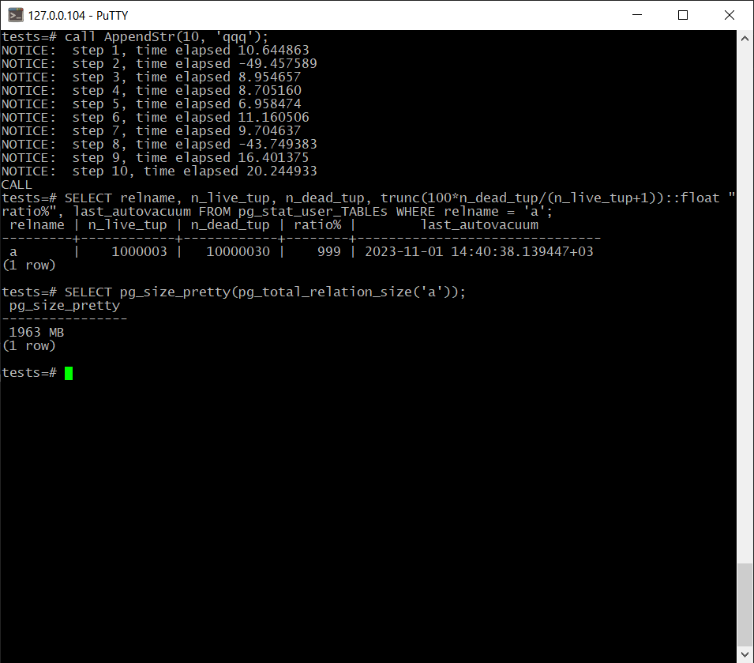

# Домашняя работа № 5

# Подготовка
Созданна виртуальная машина:

*Виртуальный жесткий диск и все что качается виртуальной машины расположено на внешнем SSD - что может отражаться на скорости* 

# Основная работа

> Создать инстанс ВМ с 2 ядрами и 4 Гб ОЗУ и SSD 10GB 
> Установить на него PostgreSQL 15 с дефолтными настройками 
> Создать БД для тестов 

> выполнить pgbench -i postgres

> Запустить pgbench -c8 -P 6 -T 60 -U postgres postgres

> Применить параметры настройки PostgreSQL из прикрепленного к материалам занятия файла

Параметры применены. Кластер перезапущен.

> Протестировать заново 
> Что изменилось и почему? 

Были изменены параметры работы сервера и его оптимизации. Учитывая что на сервер нет нагрузки и в нем только тестовая  
БД некоторые параметры, например ***_wal_size заставляют производить работы в холостую с большими WAL. 
*см.  [ветка config](https://github.com/fangarh/OTUS_PG/tree/config)*

>  Создать таблицу с текстовым полем и заполнить случайными или сгенерированными данным в размере 1млн строк  
>  Посмотреть размер файла с таблицей 
>  5 раз обновить все строчки и добавить к каждой строчке любой символ 
>  Посмотреть количество мертвых строчек в таблице и когда последний раз приходил автовакуум 

Операции выполнены

На последнем изображении процесс был повторен т.к. автовакуум успел пройти раньше формирования запроса.

>  Подождать некоторое время, проверяя, пришел ли автовакуум 
>  5 раз обновить все строчки и добавить к каждой строчке любой символ 
>  Посмотреть размер файла с таблицей 

> Отключить Автовакуум на конкретной таблице 
> 10 раз обновить все строчки и добавить к каждой строчке любой символ 
> Посмотреть размер файла с таблицей 
> Объясните полученный результат 
> Не забудьте включить автовакуум) 

Размер увеличился. В отличае от *vacuum full a;* автовакуум не производит дефрагментацию файла с хронящимися данными.  
Это необходимо делать в ручную т.к. операция очень трудозатратна и блокирует базу на долгий период.

# Задача со звёздочкой

> Задание со *: 
> Написать анонимную процедуру, в которой в цикле 10 раз обновятся все строчки в искомой таблице. 
> Не забыть вывести номер шага цикла. 

Для удобства была создана хранимая процедура, в отличае от анонимной в заголовке прописывается имя и параметры вместо *DO$$ ... DO*

Эксперемент повторен, правда вывести до отрабатывания авто-вакуума не успел.