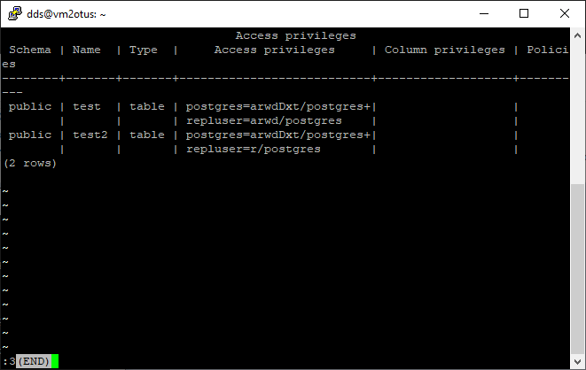
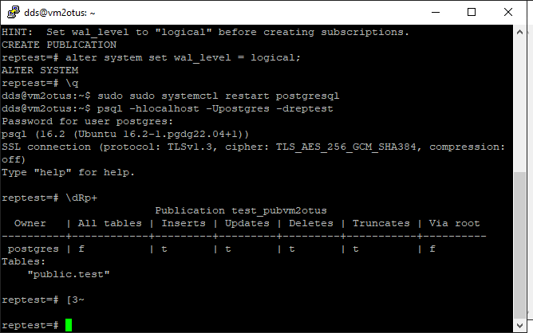
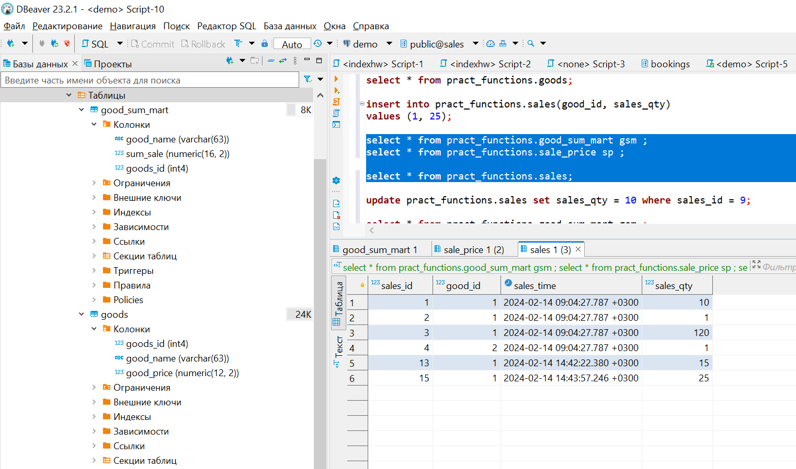

# Домашняя работа №12
# Работа с индексами и оптимизация запросов 

# Подготовка

[Изучена статья](https://habr.com/ru/articles/442170/)  
Для выполнения ДЗ используется кластер из прошлых домашних работ.<br>
Создана БД indexhw<br>
Все манипуляции будут производиться с помощью DBeaver<br>

<br>

<br>

Создаем анонимную процедуру для упрощения создания таблиц и индексов в отдельном окне скриптов.


# Основная работа
>   Создать индекс к какой-либо из таблиц вашей БД <br>
>   Прислать текстом результат команды explain, в которой используется данный индекс <br>



Как видим поиск происходит по индексу
```
Index Scan using id_generate_index on test1  (cost=0.29..18.92 rows=665 width=22)
  Index Cond: (id < 666)
```

>   Реализовать индекс для полнотекстового поиска <br>
>   Реализовать индекс на часть таблицы или индекс на поле с функцией <br>

Так как для реализации полнотекстового поиска нам необходимо конвертировать varchar в tsvector, <br>
так-же реализуем индекс для поля с функцие. 


Индекс остался старый. Выполняем поиск с *explain*<br>
Поиск при выполнение был последовательным, индекс не применился

```
Seq Scan on test1  (cost=0.00..1310.40 rows=12 width=186)
  Filter: (to_vector((textpart)::text) @@ to_tsquery('val'::text))
```

Теперь создадим индекс на функцию и пересоздадим таблицу. Для полнотекстого поиска используем gin индекс
Так-же добавил индекс на часть таблицы идентификаторов.



В результате получаем:
```
explain
select * from test1 where to_vector(textPart) @@ to_tsquery('val');
```

Поиск проведен в "куче" по индексу, а не последовательным перебором. Индекс отработал.

```
Bitmap Heap Scan on test1  (cost=52.34..69.49 rows=12 width=186)
  Recheck Cond: (to_vector((textpart)::text) @@ to_tsquery('val'::text))
  ->  Bitmap Index Scan on gin_text_search_index  (cost=0.00..52.34 rows=12 width=0)
        Index Cond: (to_vector((textpart)::text) @@ to_tsquery('val'::text))
```

```
explain
select * from test1 where id < 555;
```

Поиск происходит по индексу. 

```
Index Scan using id_generate_index_part on test1  (cost=0.28..17.97 rows=554 width=22)
  Index Cond: (id < 555)
```
```
explain
select * from test1 where id > 777;
```

Поиск происходит последовательно, т.к. пройдена верхняя граница 666. 

```
Seq Scan on test1  (cost=0.00..189.00 rows=9223 width=22)
  Filter: (id > 777)
```

>    Создать индекс на несколько полей <br>

Для начала удоляем все индексы. и выполняем тестовый запрос.



Результат выполнения - последовательный поиск
```
Seq Scan on test1  (cost=0.00..100.48 rows=270 width=186)
  Filter: ((id > 555) AND (numpart > 555))
```

Теперь создадим индекс на текстовое и числовое поле - мультииндекс.


Как видим обе операции происходят в индексе а не последовательным сканированием.

```
Index Scan using multi_index on test1  (cost=0.29..172.69 rows=1533 width=22)
  Index Cond: ((id > 555) AND (numpart > 555))
```

>    Написать комментарии к каждому из индексов <br>
>    Описать что и как делали и с какими проблемами столкнулись <br>

По ходу выполнения ДЗ были описаны индексы, проблем с выполнением не возникло.


# Задача со звёздочкой
> Отсутствует