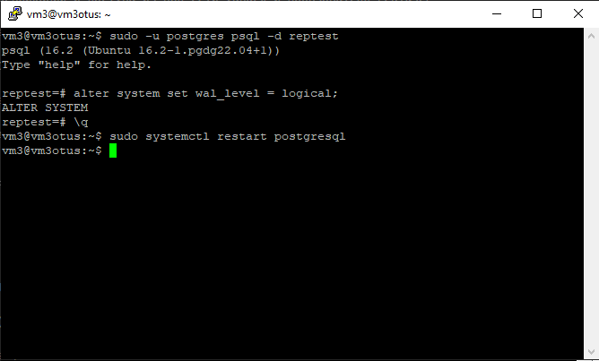
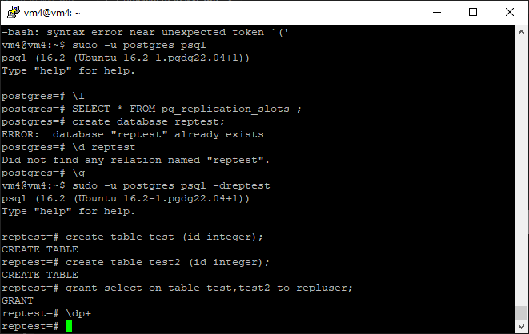
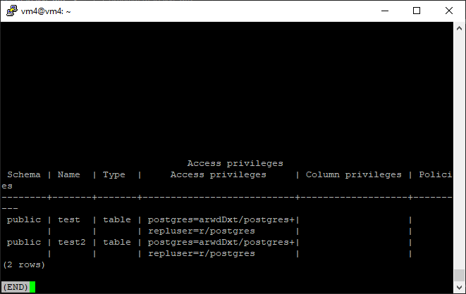

# Домашняя работа №11
# Репликация

# Подготовка
Разворачиваем 3 ВМ на yandex cloud.
Устанавливаем Postgres


Сразу прописываем настройки для репликаций и доступа из под сети yandex и пользователя repluser


Проверяем доступность серверов PG


На всех ВМ создаем пользователя для репликаций, создаем БД для работы.

```
create role repluser WITH PASSWORD 'r4e3w2q1' LOGIN REPLICATION;
create database reptest;
```

# Основная работа

## На *vm2otus* создаем таблицы test для записи, test2 для запросов на чтение.


## Создаем публикацию таблицы test и подписываемся на публикацию таблицы test2 с *vm3otus*

```

-- переключаемся на логическую репликацию () необходим перезапуск кластера

alter system set wal_level = logical;
```


Создаем публикацию для таблици test на *vm2otus*
```
CREATE PUBLICATION testpubvm2otus FOR TABLE test;
```


Создаем подписку на *vm3otus*
```

CREATE SUBSCRIPTION testpubvm3otus CONNECTION 'host=10.128.0.18 port=5432 user=repluser password=r4e3w2q1 dbname=reptest' PUBLICATION testpubvm3otus WITH (copy_data = true);
```


При создании первой репликации была сделана опечатка, по этому в списке реплик 2.

## На vm3otus создаем таблицы test2 для записи, test для запросов на чтение.


## Создаем публикацию таблицы test2 и подписываемся на публикацию таблицы test1 с vm2otus.

```
CREATE PUBLICATION testpub3_vm3 FOR TABLE test2;
```


```
CREATE SUBSCRIPTION test_pubvm1 CONNECTION 'host=10.128.0.19 port=5432 user=repluser password=r4e3w2q1 dbname=reptest' PUBLICATION test_pubvm1 WITH (copy_data = true);
```


## vm4 использовать как реплику для чтения и бэкапов (подписаться на таблицы из ВМ vm2otus и vm3otus ).

Создаем таблицы на vm4 и даем права нашему пользователю





Подписываемся на публикацию таблицы test с ВМ vm2otus и на на публикацию таблицы test2 с ВМ vm3otus

```
CREATE SUBSCRIPTION testpubvm3otus1 CONNECTION 'host=10.128.0.18 port=5432 user=repluser password=r4e3w2q1 dbname=reptest' PUBLICATION test_pubvm2otus WITH (copy_data = true);
CREATE SUBSCRIPTION test_pubvm111 CONNECTION 'host=10.128.0.19 port=5432 user=repluser password=r4e3w2q1 dbname=reptest' PUBLICATION testpub3_vm3 WITH (copy_data = true);
```


# ДЗ сдается в виде миниотчета на гитхабе с описанием шагов и с какими проблемами столкнулись.

Основной проблемой стало неудобство работы с 3 ВМ в соседних окнах и постоянно возникающая путанница в связи с этим. 