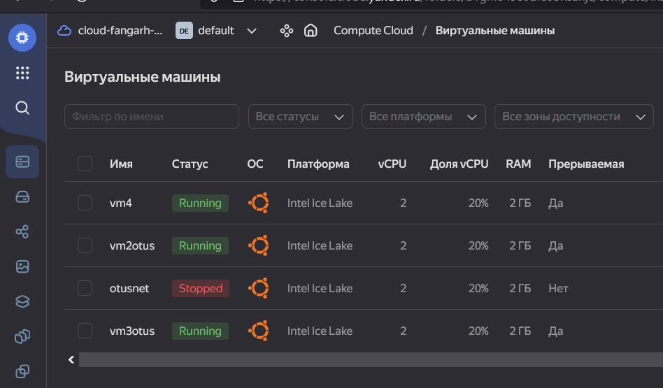

# Домашняя работа №

# Подготовка

В качестве подготовки к домашней работе создано 2 виртуальных машины и один дополнительный виртуальный диск.

На первую машину установлен posgres 15 и примонтирован новый hdd. Пока без файлов

В базе данных созданы таблицы с тестовым наполнением

> остановите postgres например через sudo -u postgres pg_ctlcluster 15 main stop
> сделайте пользователя postgres владельцем /mnt/data - chown -R postgres:postgres /mnt/data/
> перенесите содержимое /var/lib/postgres/15 в /mnt/data - mv /var/lib/postgresql/15 /mnt/data

Проведены необходимые операции.

