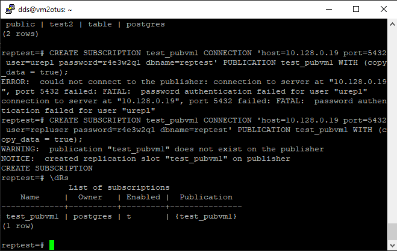

# Домашняя работа №

# Подготовка

В качестве подготовки к домашней работе создано 2 виртуальных машины и один дополнительный виртуальный диск.

На первую машину установлен posgres 15 и примонтирован новый hdd. Пока без файлов

В базе данных созданы таблицы с тестовым наполнением

> остановите postgres например через sudo -u postgres pg_ctlcluster 15 main stop
> сделайте пользователя postgres владельцем /mnt/data - chown -R postgres:postgres /mnt/data/
> перенесите содержимое /var/lib/postgres/15 в /mnt/data - mv /var/lib/postgresql/15 /mnt/data

Проведены необходимые операции.

> попытайтесь запустить кластер - sudo -u postgres pg_ctlcluster 15 main start  
> напишите получилось или нет и почему 
> задание: найти конфигурационный параметр в файлах раположенных в /etc/postgresql/15/main который надо поменять и поменяйте его 
> напишите что и почему поменяли  

Кластер не стартуется.

Причина по каторой не произошел запуск кластера : мы перенесли на внешний HDD файлы тэблспэйсов и данные системных таблиц. 
Серверная часть не смогла их найти и поэтому не стартуется.

В конфигурации сервера **postgres.conf** есть специальный раздел, в котором прописываются пути.
Для решения нашей проблемы надо исправить параметр: **data_directory** 

Внеся изменения в нем, на новый путь мы решим проблему мешавшую стартовать серверу. 

> попытайтесь запустить кластер - sudo -u postgres pg_ctlcluster 15 main start 
> напишите получилось или нет и почему 
> зайдите через через psql и проверьте содержимое ранее созданной таблицы 

Учитывая внесенные изменения, после перезагрузки серверной части,  postgres 
должен обратиться к файлам данных по новому пути и запуститься

Проверяем на соответствие данных:

> задание со звездочкой *: не удаляя существующий инстанс ВМ сделайте новый, поставьте на его PostgreSQL, удалите файлы с данными из /var/lib/postgres,  
> перемонтируйте внешний диск который сделали ранее от первой виртуальной машины ко второй и запустите PostgreSQL на второй машине так чтобы он работал  
> с данными на внешнем диске, расскажите как вы это сделали и что в итоге получилось.  

На второй виртуальной машине развернут чистый кластер 16 версии. Примонтированных дисков нет.

