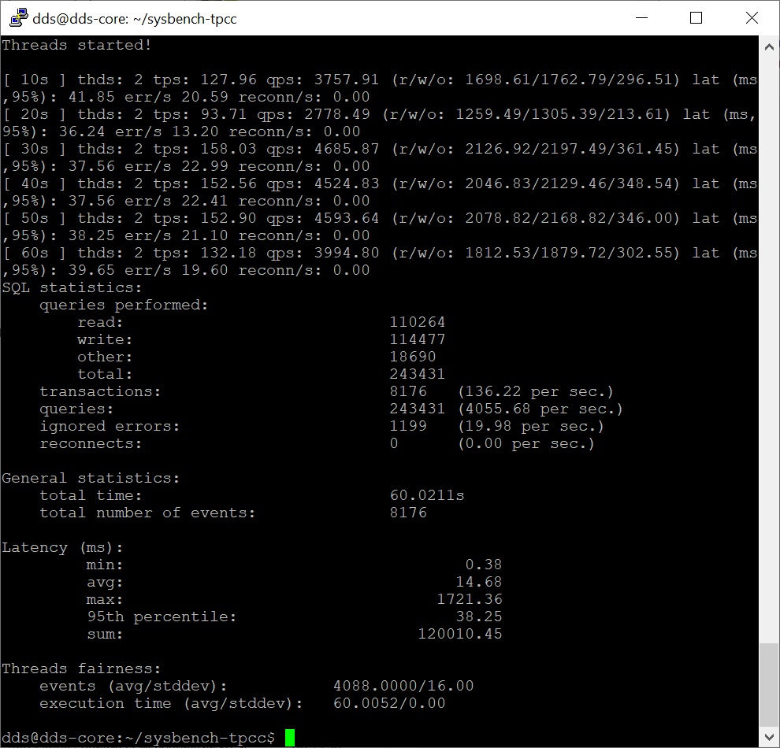

# Домашняя работа №9
# Нагрузочное тестирование и тюнинг PostgreSQL
# Подготовка

> развернуть виртуальную машину любым удобным способом  
> поставить на неё PostgreSQL 15 любым способом 
> настроить кластер PostgreSQL 15 на максимальную производительность не обращая внимание на возможные проблемы с надежностью в случае аварийной перезагрузки виртуальной машины 

* Развернута виртуальная машина VirtualBox
* Параметры: HDD(50ГБ), 8GB Ram, 1 core, 100% usage
* Установлен PG 15

 
 

# Основная работа
> нагрузить кластер через утилиту через утилиту pgbench (https://postgrespro.ru/docs/postgrespro/14/pgbench) 

* Изначальная конфигурация: 
* pgbench -c30 -P 6 -T 60  -h localhost -U postgres speedtest  

 

> написать какого значения tps удалось достичь, показать какие параметры в какие значения устанавливали и почему 

* Изменены параметры памяти: 
shared_buffers = 2GB 
work_mem = 32MB 
maintenance_work_mem = 410MB 
effective_cache_size = 6GB 
 

* Изменены параметры репликаций 
max_wal_senders = 0 
 

* Контрольные точки 
checkpoint_completion_target = 0.9 
random_page_cost = 4 
max_wal_size = 2GB 
min_wal_size = 1GB 

 
Внесенные изменения глобальных улучшений не дали. Тесты показали что улучшение производительности 1% дали параметры контрольной точки. 
 

* Параметры использования ядер процессора 
max_worker_processes = 8 
max_parallel_workers_per_gather = 2 
max_parallel_workers = 8 

 

 
Судя по итогам тестов - все упирается в HDD. Для ускорение сделаем запись WAL в асинхронном режиме. 
synchronous_commit = off 
Как видно результат прирост производительности в 2 раза.  
 

 
 
Так же имеет смысл попробовать отключить принудительную запись изменений на диск fsync, что грозит потерей данных в случае сбоя. 
fsync = off; 
 

  

 
Но в итоге параметр возвращен, так-как прирост менее 1% 
 

# Задача со звёздочкой 
 
> Задание со *: аналогично протестировать через утилиту https://github.com/Percona-Lab/sysbench-tpcc  
>  (требует установки https://github.com/akopytov/sysbench) 
 
Устанавливает sysbench: 
 

* curl -s https://packagecloud.io/install/repositories/akopytov/sysbench/script.deb.sh | sudo bash 
* sudo apt -y install sysbench 
* git clone https://github.com/Percona-Lab/sysbench-tpcc && cd sysbench-tpcc 
 

 
 

* Подготавливаем БД и запуск теста 
./tpcc.lua --pgsql-port=5433 --pgsql-user=postgres --pgsql-password=**** --pgsql-db=speedtest --time=60 --scale=10 --threads=2 --report-interval=1  --tables=1 --db-driver=pgsql prepare 
./tpcc.lua --pgsql-port=5433 --pgsql-user=postgres --pgsql-password=**** --pgsql-db=speedtest --time=60 --scale=10 --threads=2 --report-interval=5  --tables=1 --db-driver=pgsql run 
 

 
 

* Запускаем тест на новом кластере 
./tpcc.lua --pgsql-port=5433 --pgsql-user=postgres --pgsql-password=**** --pgsql-db=speedtest --time=60 --scale=10 --threads=2 --report-interval=1  --tables=1 --db-driver=pgsql prepare 
./tpcc.lua --pgsql-port=5433 --pgsql-user=postgres --pgsql-password=**** --pgsql-db=speedtest --time=60 --scale=10 --threads=2 --report-interval=5  --tables=1 --db-driver=pgsql run 

 
 