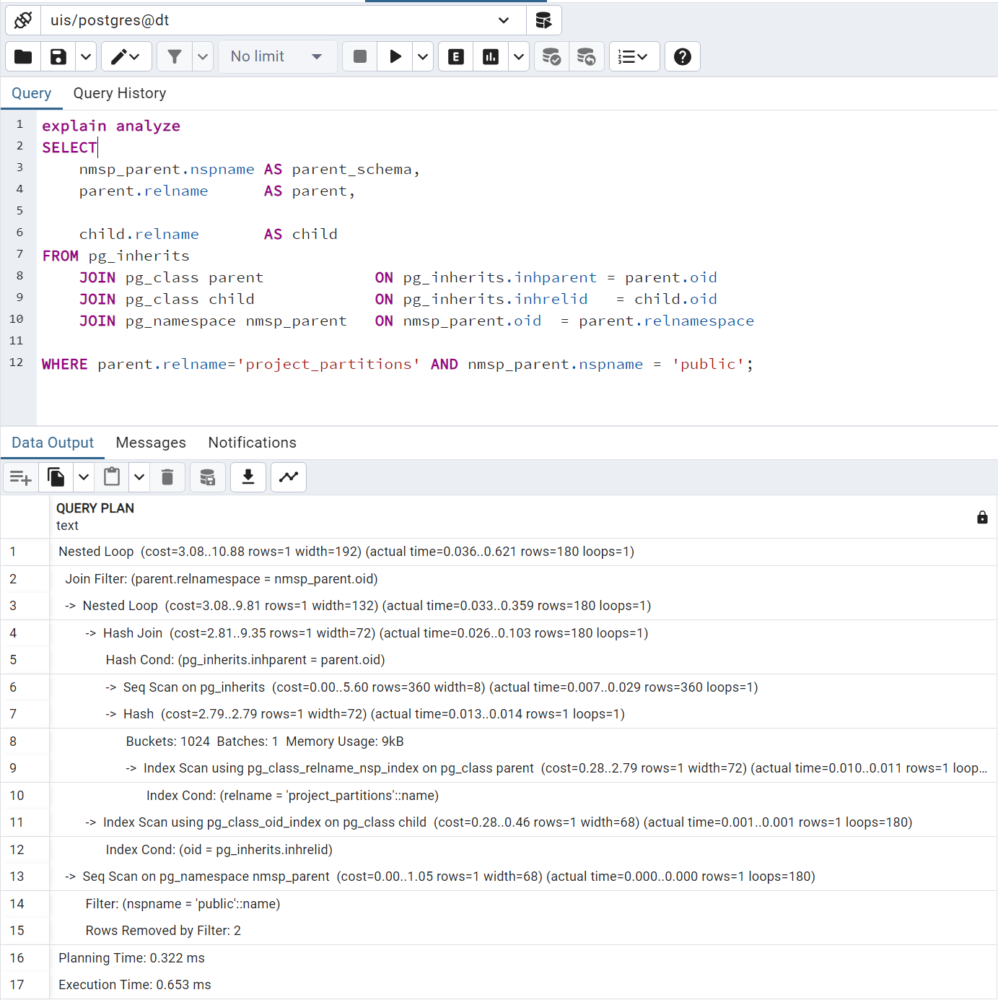
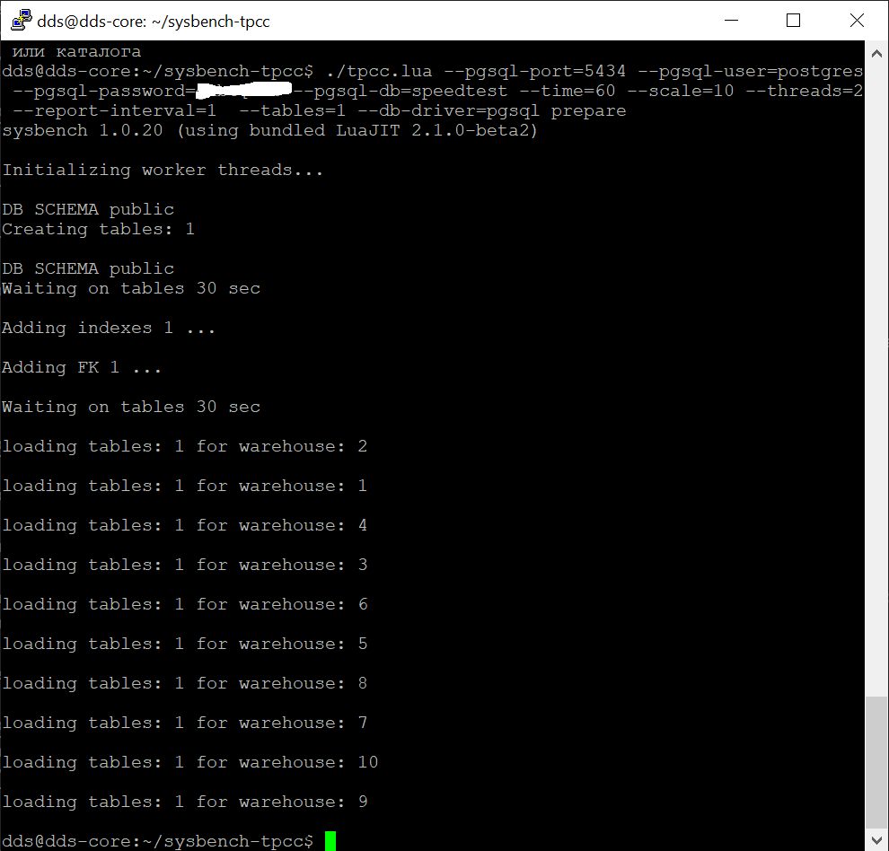
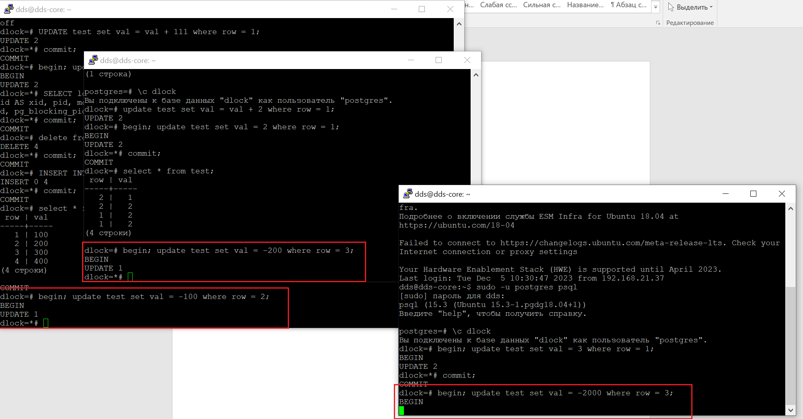
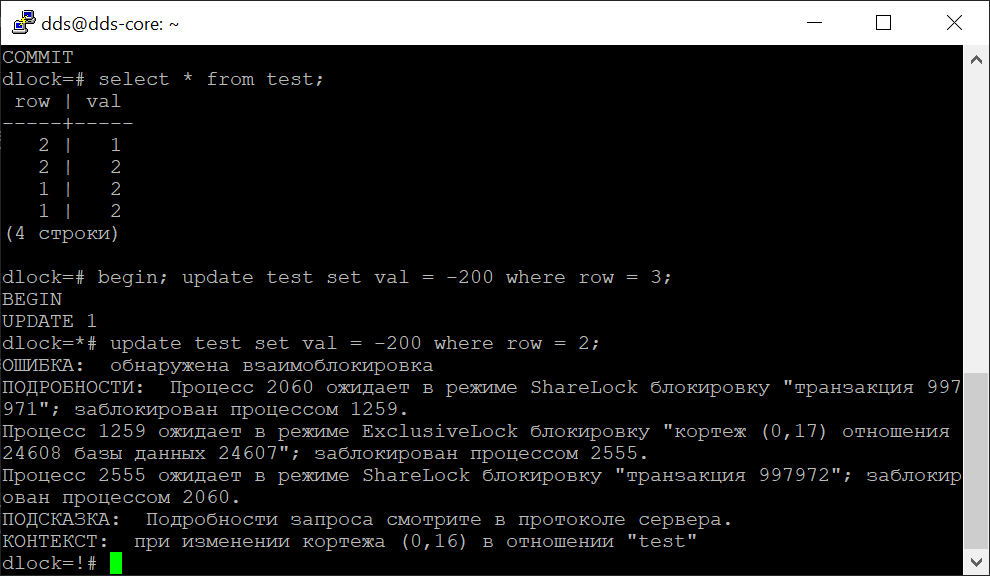

# Домашняя работа №8
# Механизмы блокировок

# Выполнена подготовка

>   Настройте сервер так, чтобы в журнал сообщений сбрасывалась информация о блокировках, удерживаемых более 200 миллисекунд.  

При выполнении работы [использовалась статья](https://habr.com/ru/companies/postgrespro/articles/465263/)

# Основная работа

>   Воспроизведите ситуацию, при которой в журнале появятся такие сообщения. 

 
Далее в первой сессию выполнен COMMIT. Транзацкия во второй сессии сразу завершилась обновлением данных, т.к блокировка записи снялась. 
Данные о блокировках отображены в журнале. 

>   Смоделируйте ситуацию обновления одной и той же строки тремя командами UPDATE в разных сеансах.  
>   Изучите возникшие блокировки в представлении pg_locks и убедитесь, что все они понятны.  
>   Пришлите список блокировок и объясните, что значит каждая. 

Выполним в трех сессиях:
begin; update test set val = 1 where row = 1;
begin; update test set val = 2 where row = 1;
begin; update test set val = 3 where row = 1;

Первая сессия наложила эксклюзивную блокировку от изменений на обновляемые строки доступ к данным таблицы остался.   
Вторая сессия видит эксклюзивную блокировку строки, которую хочет изменить, создала кортеж (tuple) из строки которую хочет заблокировать для изменения и заснула, и первой транзакцией наложилась Shared блокировка на созданный кортеж. Доступ к таблице остался  
Третья сессия эксклюзивная построчная блокировка RowExclusiveLock, доступ к таблице остается.   
Третья транзакция ссылается на созданный второй транзакцией кортеж и доступ к кортежу закрыт, т.к. вторая транзакция спит. И все следующие транзакции операции UPDATE этой строки будут ссылаться на созданный во второй транзакции кортеж.  

>   Воспроизведите взаимоблокировку трех транзакций. Можно ли разобраться в ситуации постфактум, изучая журнал сообщений? 

Выполним в первой сессии обновление второй строки, в двух других обновление третьей.
begin; update test set val = -100 where row = 2;
begin; update test set val = -200 where row = 3;
begin; update test set val = -2000 where row = 3;

Теперь в первой сессии обновим строку три не завершая транзакции.
begin; update test set val = -100 where row = 3;
И встречно во втором сеансе
update test set val = -200 where row = 2;

В журнале сообщений можно увидеть: какие транзакции и какие команды привели к взаимной блокировке в каком процессе. Для отслеживания лог 
 если смотреть сверху вниз, то можно отследить порядок команд, приведших к блокировке.

# Задача со звёздочкой
>   Могут ли две транзакции, выполняющие единственную команду UPDATE одной и той же таблицы (без where), заблокировать друг друга? 
> Cэмулировать: две транзакции, выполняющие единственную команду UPDATE одной и той же таблицы (без where), заблокировав друг друга

Данная ситуация возможна при наличае индекса, в случае с отключенным последовательным сканированием в одной из сессий.

* Добавим индекс в наши таблицы: CREATE INDEX ON test(val DESC);
* В одной из сессий делаем SET enable_seqscan = off; 

В одном случае планировщик пойдет по индексу, в другом последовательный поиск в месте их встречи произойдет блокировка, правда поймать этот момент на легких запросах практически не возможно.