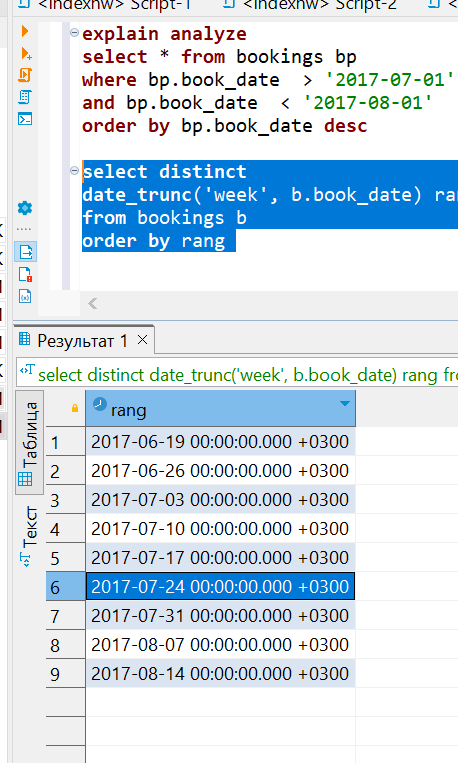

# Домашняя работа №2
### Тема "Установка PostgreSQL"

> создать ВМ с Ubuntu 20.04/22.04 или развернуть докер любым удобным способом  
> поставить на нем Docker Engine 
> сделать каталог /var/lib/postgres 

Для опытов создана еще папка /var/lib/pg_docler 

> развернуть контейнер с PostgreSQL 15 смонтировав в него /var/lib/postgresql

Развернут контейнер с сервером PG. Прокинут порт на новый: 5434 
Папка с тэйблспэйсами примонтирована к папке VM **/var/lib/pg_docler**

> развернуть контейнер с клиентом postgres 
> подключится из контейнера с клиентом к контейнеру с сервером и сделать таблицу с парой строк 
> подключится к контейнеру с сервером с ноутбука/компьютера извне инстансов GCP/ЯО/места установки докера 

Установлено соединение с сервером в докере через контейнер клиент. Создана таблица с данными

Проброшены порты для NAT сети в VirtualBox

Установлено подключение к серверу-контейнеру с ноутбука где хостится VM

> удалить контейнер с сервером

> создать его заново 
> подключится снова из контейнера с клиентом к контейнеру с сервером 
> проверить, что данные остались на месте 

Переустановлен контейнер

Произведено подключение из вне. 

 
Данные сохранились, т.к. тэйблспэйсы создавались в созданной изначально папке **/var/lib/pg_docler**  
При удалении контейнера, примонтированные папки не очищаются.  