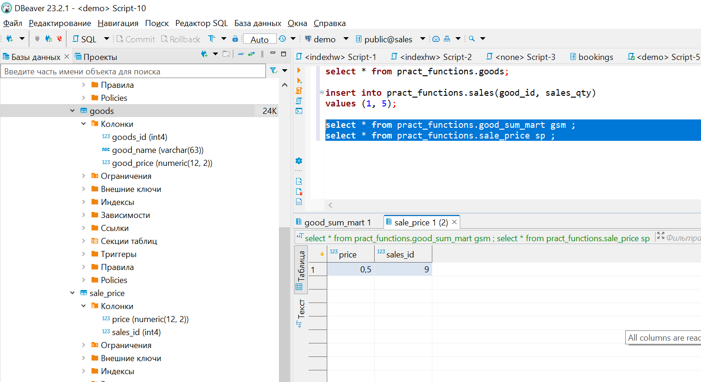
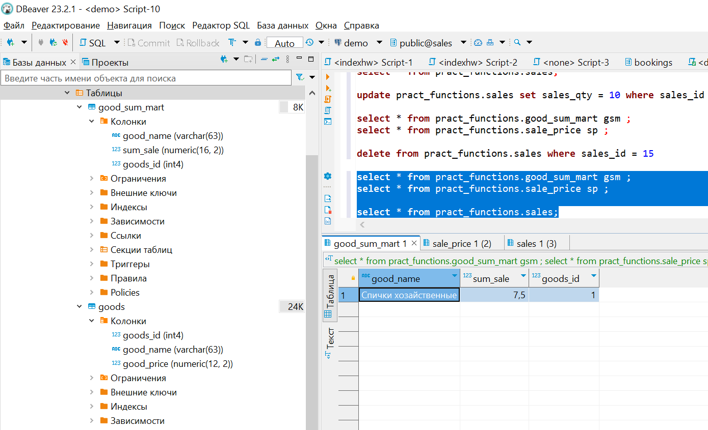

# Домашняя работа №15
# Тема: Триггеры, поддержка заполнения витрин

# Подготовка
Создана БД на основании файла *hw_triggers.sql*


# Задача со звёздочкой

Чем такая схема (витрина+триггер) предпочтительнее отчета, создаваемого "по требованию" (кроме производительности)? <br/>
Подсказка: В реальной жизни возможны изменения цен.

При данной схеме отчет по прадажам будет формироваться без учета изменения цен. <br/>
Для исправления данной проблемы необходимо заранее правильно проектировать БД и работу с ней, т.к. тригеры не является лучшим решением.<br/>
В данной домашней работе будет реализовано решение проблемы на уровне БД без *значительного* влияние на код, работающий с БД из системы, так как <br/>
для реализации потребуется создать таблицу истории изменения цен и идентификатор продукта в табличке витрины<br/>
! По имеющемуся опыту работы, идентификаторы необходимо создавать вообще во всех таблицах, не зависимо от его необходимости в момент проектирования БД<br/>
! Некоторые ОРМ не могут работать с таблицами в которых отсутствует первичный ключ.<br/>

# Основная работа
Скрипт и развернутое описание задачи – в ЛК (файл hw_triggers.sql) или по ссылке: https://disk.yandex.ru/d/l70AvknAepIJXQ <br/>
В БД создана структура, описывающая товары (таблица goods) и продажи (таблица sales).<br/>
Есть запрос для генерации отчета – сумма продаж по каждому товару.<br/>
БД была денормализована, создана таблица (витрина), структура которой повторяет структуру отчета.<br/>
Создать триггер на таблице продаж, для поддержки данных в витрине в актуальном состоянии (вычисляющий при каждой продаже сумму и записывающий её в витрину)<br/>
Подсказка: не забыть, что кроме INSERT есть еще UPDATE и DELETE<br/>

## Дорабатываем структуру БД

Создаем таблицу истории цен:

```
create table sale_price(
	price numeric (12,2),
	sales_id integer
);
```

Создаем идентификатор тавара в табличке витрины:
```
alter table good_sum_mart add column goods_id integer;
```


## Тригер на добавление записи

При добавлении продажи пересчитываем сумму продаж по товару(ориентируемся по Id) и запоминаем стоимость при продаже, <br/>
в случае изменения продажы, пересчет будем делать по сохраненной стоимости, а не текущей. 

```
create or replace function insert_sales_trigger() 
returns trigger 
language plpgsql
set search_path = pract_functions
as $$
declare
	goodName goods.good_name%type;
	goodPrice goods.good_price%type;    
begin
	select g.good_name, g.good_price
	into strict goodName, goodPrice	
	from goods g
	where g.goods_id = new.good_id;

	insert into sale_price (sales_id, price) values (new.sales_id, goodPrice);
	
	update good_sum_mart set 
	sum_sale = sum_sale + (new.sales_qty * goodPrice)
	where goods_id = new.good_id;
	
	if not found then
		insert into good_sum_mart(good_name, sum_sale, goods_id)
		values (goodName, new.sales_qty * goodPrice, new.good_id);
	end if;
	return new; 
end;

$$;

drop trigger if exists t_sales_after_insert on  pract_functions.sales ;

create trigger t_sales_after_insert after insert on pract_functions.sales 
for each row 
execute procedure insert_sales_trigger();
```

### Проверяем:




## Тригер на обновление записи

При обновление записи, в случае сохранения вида товара, исправляем по старой цене. Если товар обновлен пересчитываем по новой цене.

```
create or replace function update_sales_trigger() 
returns trigger 
language plpgsql
set search_path = pract_functions
as $$
declare
	goodPrice sale_price.price%type;    
begin
	select s.price
	into strict goodPrice	
	from sale_price s
	where s.sales_id = new.sales_id;

	if new.good_id = old.good_id then	
		update good_sum_mart set
		sum_sale = sum_sale + (new.sales_qty * goodPrice) - (old.sales_qty * goodPrice)
		where goods_id = new.good_id;		
	else
		update good_sum_mart set
		sum_sale = sum_sale - (old.sales_qty * goodPrice)
		where goods_id = new.good_id;			
	
		select g.good_price	
		into strict goodPrice	
		from goods g
		where g.goods_id = new.good_id;
	
		update good_sum_mart set
		sum_sale = sum_sale + (new.sales_qty * goodPrice)
		where goods_id = new.good_id;			
			
		update sale_price set price = goodPrice where sales_id = new.sales_id;

	end if;
	
	return new; 
end;

$$;


drop trigger if exists t_sales_after_update on  pract_functions.sales ;

create trigger t_sales_after_update after update  on pract_functions.sales 
for each row 
execute procedure update_sales_trigger();
```

### Проверяем:


## Тригер на удаление записи

При удалении продажи берем стоимость из таблички с историями, после чего вычетаем соответствующее количество из суммы. Не забываем подтереть запись в табличке с историей цен.

```

create or replace function delete_sales_trigger() 
returns trigger 
language plpgsql
set search_path = pract_functions
as $$
declare
	goodPrice sale_price.price%type;    
begin
	select s.price
	into strict goodPrice	
	from sale_price s
	where s.sales_id = old.sales_id;

	update good_sum_mart set
	sum_sale = sum_sale - (old.sales_qty * goodPrice)
	where goods_id = new.good_id;		

	delete from sale_price where sales_id = old.sales_id;

	return new; 
end;

$$;

drop trigger if exists t_sales_after_delete on  pract_functions.sales ;

create trigger t_sales_after_delete after delete on pract_functions.sales 
for each row 
execute procedure delete_sales_trigger();

```

### Проверяем


