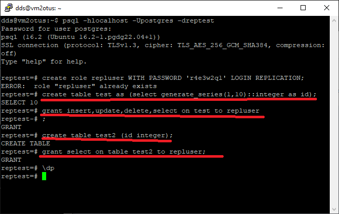

# Домашняя работа №14
# Тема: Секционирование таблицы

# Подготовка

# Основная работа
## Секционировать большую таблицу из демо базы flights
>
	Для мекционирования возьмем таблицу *bookings* она достаточно большая, так что итог секционирования будет нагляден (особенно с учетом HDD), так-же это самая большая таблицца с датами.
Для секционирования будет применен метод *BY RANGE* по полю *book_date* с недельным интервалом (загружена база small).

Для начала выполним поиск и посмотрим статистику:
```
explain analyze
select * from bookings bp 
where bp.book_date  > '2017-07-01'
and bp.book_date  < '2017-08-01'
order by bp.book_date desc
```


Для удобства реализуем анонимную функция которая создаст секционированную таблицу, а потом секции для данной таблицы.

```
do $$
declare
	query text;
    lowRange varchar(16);
    highRange varchar(16);
    cRow record;
begin
	drop table if exists bookings_r;
	create table bookings_r(
		book_ref bpchar(6) not null,
		book_date timestamptz,
		total_amount numeric(10,2)
	) partition by range (book_date);

    for cRow in (select distinct 
    	date_trunc('week', b.book_date) rang 
    	from bookings b 
    	order by rang 
    ) loop 
	    lowRange := to_char(cRow.rang, 'YYYY-MM-DD') ;
  	    highRange := to_char(cRow.rang + interval '1 week', 'YYYY-MM-DD');
  	   
  	    query := format(
  	    	$que$
  	    		create table bookings_r_%s partition of bookings_r
  	    		for values from ('%s') to ('%s');
  	    	$que$, to_char(cRow.rang, 'YYYY_MM_DD'), lowRange, highRange
  	    );
  	   
  	    execute query;
	end loop;
end;
$$
```


Теперь необходимо заполнить секционированную таблицу.


И повторяем поиск


Для данного объема данных прирост весьма существенный. Увеличение времени планирования, так-же логично - происходит выборка сеций в которых производить поиск. 
Более наглядным примером будет поиск внутри 1 секции:


>
>
>